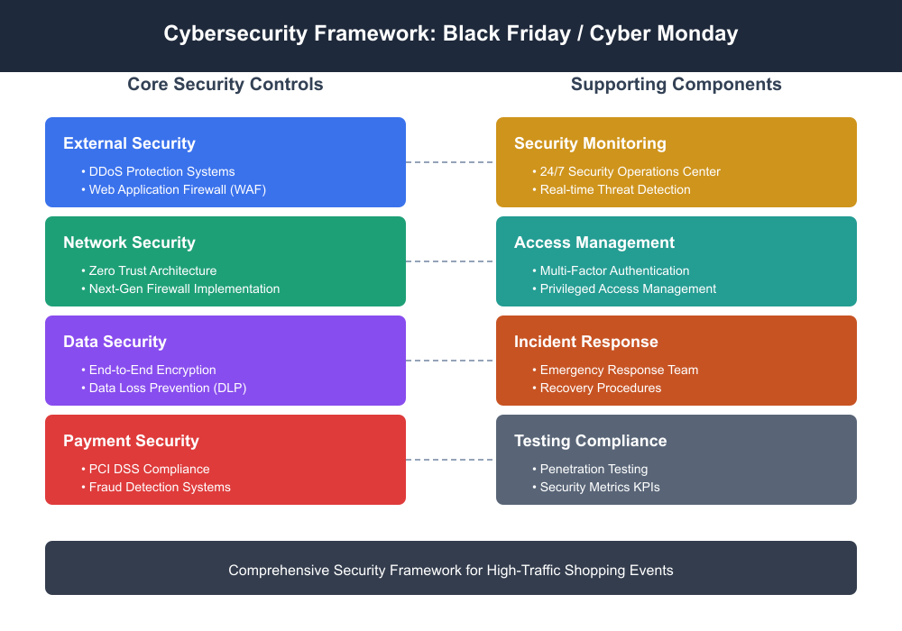

# InfoSec Black Friday Deals – Cybersecurity Certification Courses and Training Discounts - 2025

Black Friday isn't just for shopping; it's prime time for advancing your cybersecurity career. Our InfoSec Black Friday certification deals offer decent savings on premium certification training programs for IT professionals, DevOps Engineers, System Administrators, and IT Security managers. From AI Security to Threat Modeling, discover exclusive discounts on vendor-neutral certifications that validate your expertise and accelerate career growth.

  

## Why Investing in Security Certifications Pays Off

Security jobs are splitting into specialized roles with better pay. Companies don't need generalists anymore. They require people who can secure AI systems from prompt injection, automate security across CI/CD pipelines, model threats in complex architectures, and defend Kubernetes clusters in production. 

These aren't nice-to-have skills. They're what separates $80K roles from $130K+ positions. Certifications prove you've done the work hands-on, not just watched videos. Upskilling now provides you with access to roles that didn't exist two years ago and leverage during salary negotiations that theory alone never will.

## 9 Best Practical DevSecOps Certification Courses - Black Friday Sale 2025 - Save up to USD 500, (Enroll now, Study Later)

**Course Name**

**Certified DevSecOps Professional (CDP)**

*What You Will Learn:*

- Integrate SCA, SAST, DAST in CI/CD pipelines
- Automate security testing across entire SDLC
- Apply IaC and Compliance as Code techniques
- Progress from DSOMM Level 0 to Level 2

**BFCM Sale Discount:** *Save $135*

**Link to Course Page:** https://www.practical-devsecops.com/certified-devsecops-professional/

______________________________________________________________________________________________

**Course Name**

**Certified AI Security Professional (CAISP)**

*What You Will Learn:*

- Counter LLM threats with the OWASP Top 10 framework.
- Mitigate AI supply chain risks and attacks
- Apply AI threat modeling with STRIDE methods
- Secure DevOps against AI-specific attacks

**BFCM Sale Discount:** *Save $150*

**Link to Course Page:** https://www.practical-devsecops.com/certified-ai-security-professional/

______________________________________________________________________________________________

**Course Name**

**Certified Cloud-Native Security Expert (CCNSE)**

*What You Will Learn:*

- Identify and exploit Kubernetes supply chain attacks
- Implement RBAC and certificate-based auth
- Use Network Policies and Service Meshes
- Deploy OPA Gatekeeper and Pod Security Standards

**BFCM Sale Discount:** *Save $150*

**Link to Course Page:** https://www.practical-devsecops.com/certified-cloud-native-security-expert/

______________________________________________________________________________________________

**Course Name**

**Certified Threat Modeling Professional (CTMP)**

*What You Will Learn:*

- Apply STRIDE, PASTA, VAST, and RTMP frameworks
- Build threat models into DevOps pipelines
- Use IriusRisk and OWASP Threat Dragon tools
- Prioritize risks with DREAD and OWASP methods

**BFCM Sale Discount:** *Save $120*

**Link to Course Page:** https://www.practical-devsecops.com/certified-threat-modeling-professional/

______________________________________________________________________________________________

**Course Name**

**Certified API Security Professional (CASP)**

*What You Will Learn:*

- Apply tools to detect injection attacks
- Implement JWT tokens and OAuth 2.0 workflows
- Protect REST, GraphQL, and SOAP architectures
- Stop BOLA attacks with access controls

**BFCM Sale Discount:** *Save $120*

**Link to Course Page:** https://www.practical-devsecops.com/certified-api-security-professional/

______________________________________________________________________________________________

**Course Name**

**Certified Container Security Expert (CCSE)**

*What You Will Learn:*

- Build and manage Docker containers securely
- Execute image backdooring and registry exploits
- Apply Seccomp and AppArmor hardening
- Configure Sysdig Falco for runtime monitoring

**BFCM Sale Discount:** *Save $75*

**Link to Course Page:** https://www.practical-devsecops.com/certified-container-security-expert/

______________________________________________________________________________________________

**Course Name**

**Certified DevSecOps Expert (CDE)**

*What You Will Learn:*

- Create custom rulesets to reduce false positives
- Build hardened golden images with Ansible
- Automate security requirements in code
- Configure advanced API security using OpenAPI

**BFCM Sale Discount:** *Save $180*

**Link to Course Page:** https://www.practical-devsecops.com/certified-devsecops-expert/

______________________________________________________________________________________________

**Course Name**

**Certified Software Supply Chain Security Expert (CSSE)**

*What You Will Learn:*

- Protect source code and container registries
- Detect dependency confusion attacks early
- Build security from repository to production
- Apply NIST SSDF, CIS, and SLSA frameworks

**BFCM Sale Discount:** *Save $120*

**Link to Course Page:** https://www.practical-devsecops.com/certified-software-supply-chain-security-expert/

______________________________________________________________________________________________

**Course Name**

**Certified Security Champion (CSC)**

*What You Will Learn:*

- Defend against OWASP Top 10 threats
- Identify SQL Injection, XSS, and code flaws
- Configure CI/CD security tools effectively
- Apply Infrastructure as Code security

**BFCM Sale Discount:** *Save $75*

**Link to Course Page:** https://www.practical-devsecops.com/certified-security-champion/

______________________________________________________________________________________________

## Course Bundles

<table border="1" cellpadding="5" cellspacing="0">
<thead>
<tr>
<th>Bundle Name</th>
<th>Total Labs</th>
<th>InfoSec Black Friday Deals</th>
<th>Perfect For</th>
</tr>
</thead>
<tbody>
<tr>
<td>DevSecOps + AI Security (<a href="https://www.practical-devsecops.com/certified-devsecops-professional/">CDP</a> + <a href="https://www.practical-devsecops.com/certified-ai-security-professional/">CAISP</a>)</td>
<td>130+ hands-on labs</td>
<td>Save $369 on the bundle.</td>
<td>AI Offensive Orchestrator, AI/ML Security Engineer, AI Security Specialist, AI Incident Response Orchestrator, AI Prompt Engineer, AI SOC Orchestrator, AI Governance Lead and Quantum-AI Security Specialist.</td>
</tr>
<tr>
<td>DevSecOps (<a href="https://www.practical-devsecops.com/certified-devsecops-professional/">CDP</a> + <a href="https://www.practical-devsecops.com/certified-devsecops-expert/">CDE</a>)</td>
<td>140+ hands-on labs</td>
<td>Save $389 on the bundle</td>
<td>DevOps Engineers, Security Professionals, AppSec Engineers</td>
</tr>
<tr>
<td>DevSecOps Pro + Cloud Security (<a href="https://www.practical-devsecops.com/certified-devsecops-professional/">CDP</a> + <a href="https://www.practical-devsecops.com/certified-cloud-native-security-expert/">CCNSE</a>)</td>
<td>150+ hands-on labs</td>
<td>Save $369 on the bundle.</td>
<td>DevOps Engineers, Cloud Security Architects, System Administrators</td>
</tr>
<tr>
<td>Container + Cloud Security (<a href="https://www.practical-devsecops.com/certified-container-security-expert/">CCSE</a> + <a href="https://www.practical-devsecops.com/certified-cloud-native-security-expert/">CCNSE</a>)</td>
<td>80+ hands-on labs</td>
<td>Save $284 on the bundle.</td>
<td>Cloud Security Engineers, Kubernetes Administrators, Platform Engineers</td>
</tr>
<tr>
<td>Triple Security Bundle (<a href="https://www.practical-devsecops.com/certified-container-security-expert/">CCSE</a> + <a href="https://www.practical-devsecops.com/certified-cloud-native-security-expert/">CCNSE</a> + <a href="https://www.practical-devsecops.com/certified-api-security-professional/">CASP</a>)</td>
<td>110+ hands-on labs</td>
<td>Save $498 on the bundle.</td>
<td>Security Leadership, SOC Analysts, Product Security Engineers</td>
</tr>
<tr>
<td>Threat Modeling + API Security (<a href="https://www.practical-devsecops.com/certified-threat-modeling-professional/">CTMP</a> + <a href="https://www.practical-devsecops.com/certified-api-security-professional/">CASP</a>)</td>
<td>60+ hands-on-labs</td>
<td>Save $245 on the bundle.</td>
<td>Product Security Engineer, AppSec Engineer, API Developers, DevSecOps Engineer, Red Teamers</td>
</tr>
<tr>
<td>DevSecOps + Container (<a href="https://www.practical-devsecops.com/certified-devsecops-professional/">CDP</a> + <a href="https://www.practical-devsecops.com/certified-container-security-expert/">CCSE</a>)</td>
<td>140+ hands-on labs</td>
<td>Save $274 on the bundle.</td>
<td>Infrastructure Security Engineers, CI/CD Security Engineers, Kubernetes Specialists</td>
</tr>
<tr>
<td>DevSecOps + Threat Modeling (<a href="https://www.practical-devsecops.com/certified-devsecops-professional/">CDP</a> + <a href="https://www.practical-devsecops.com/certified-threat-modeling-professional/">CTMP</a>)</td>
<td>130+ hands-on labs</td>
<td>Save $313 on the bundle.</td>
<td>Application Security Engineers, Security Architects, Threat Modeling Analysts</td>
</tr>
<tr>
<td>DevSecOps + API Security (<a href="https://www.practical-devsecops.com/certified-devsecops-professional/">CDP</a> + <a href="https://www.practical-devsecops.com/certified-api-security-professional/">CASP</a>)</td>
<td>130+ hands-on labs</td>
<td>Save $322 on the bundle.</td>
<td>Application Security Engineers, Security Consultants, System Administrators</td>
</tr>
<tr>
<td>DevSecOps + Supply Chain (<a href="https://www.practical-devsecops.com/certified-devsecops-professional/">CDP</a> + <a href="https://www.practical-devsecops.com/certified-software-supply-chain-security-expert/">CSSE</a>)</td>
<td>140+ hands-on labs</td>
<td>Save $323 on the bundle.</td>
<td>CI/CD Pipeline Engineers, Application Security Engineers, Security Architects</td>
</tr>
</tbody>
</table>

## Conclusion

Black Friday presents the perfect opportunity for security professionals to advance their careers with industry-recognized certifications. Practical DevSecOps courses combine hands-on labs, real-world scenarios, and vendor-neutral training to build expertise that employers value.
If you are keen to learn about AI security, container protection, or threat modeling, these BFCM discounts make professional growth affordable. Don't let this limited-time opportunity pass; invest in your cybersecurity future and position yourself as an indispensable asset to your organization.

## FAQs

**1. How long do I get course access and updates?**

You get 3 years of full course access, including all updates during that period.

**2. Can I run the labs on my basic laptop?**

Yes. We offer browser-based lab access, so you don't need to install any additional software. If you can browse the web, you can do the labs. No hardware requirements to worry about.

**3. Do labs work on ARM-based Macs (M1/M2/M3)?**

Yes. Since everything runs in your browser, ARM Macs work perfectly. No compatibility issues.

**4. What if I get stuck at 2 AM on a weekend?**

We have 24/7 technical and instructor support. Get help within minutes, any time, any day.

**5. What exactly do I get with the course?**

- 3 years of video content access
- PDF course manual
- Security checklists
- 60 days of browser-based lab access
- One exam attempt for certification
- All future video course updates during your 3-year period

**6. Do I have to start immediately after buying?**

No. Buy now, start later, or whenever you're ready. You choose your start date, and your 3-year access begins from that date. You can start 2-3 months later if needed.  

## Discoverability

Infosec black friday, information security black friday, cybersec black friday, cyber security black friday, cyber monday, information security cyber monday, cybersec cyber monday, cyber security cyber monday, netsec cyber monday, hacking cyber monday infosec deals, coupons, discounts, sales, pentest, penetration test, red team, blue team, purple team, thanksgiving, blackfriday2025, cybee monday deals 2025, DevSecOps engineer, DevOps engineer, AI security engineer, appsec engineer, cybersecurity analysts, black friday deals 2025